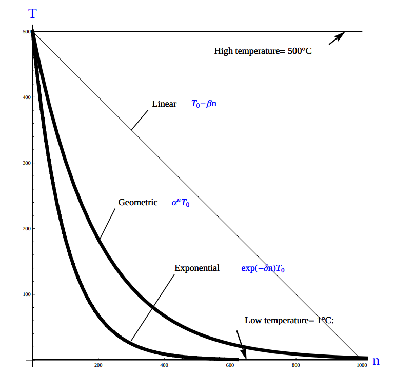
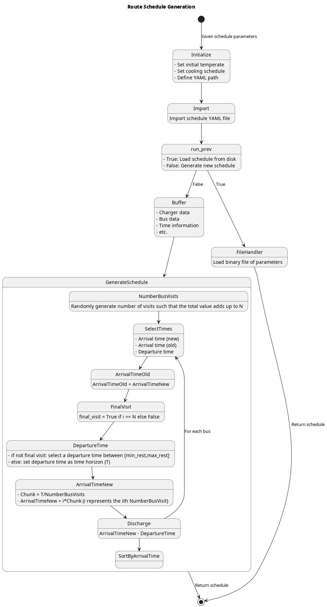
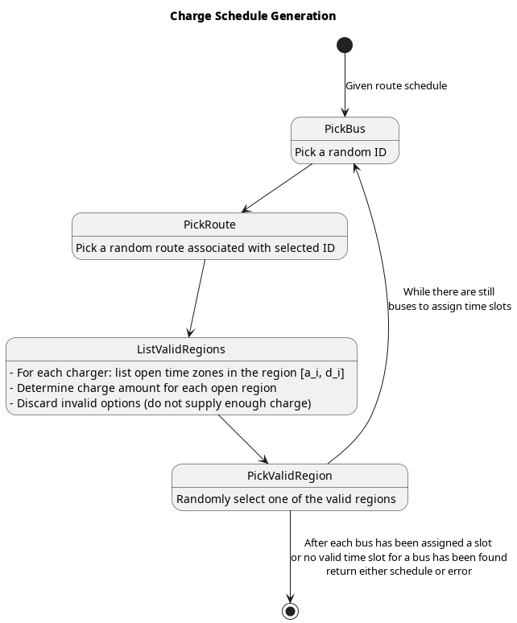
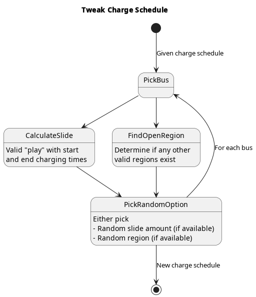

\begin{table}
	\caption{Notation used throughout the paper}
	\label{tab:variables}
	\centering
	\begin{tabular}{l l l l}
		\toprule
		\textbf{Variable} & \textbf{Description}                                                            \\
		\toprule
		\multicolumn{1}{l}{Input values}                                                                    \\
			$B$           & Number of buses in use                                                      \\
			$I$           & Number of total visits                                                      \\
			$J$           & Objective function                                                          \\
			$K$           & Local seearch iteration amount                                              \\
			$Q$           & Number of chargers                                                          \\
			$T$           & Time horizon                                                                \\
			$\Tau$        & Temperature                                                                 \\
		\hline
		\multicolumn{1}{l}{Input variables}                                                                 \\
			$\Delta_i$             & Discharge of visit over route $i$                                  \\
			$\Xi_i$                & Array of ID's for each visit $i$                                   \\
			$\alpha_i$             & Initial charge percentage time for visit $i$                       \\
			$\beta_i$              & Final charge percentage for bus $i$ at the end of the time horizon \\
			$\delta_i$             & Discharge rate for vehicle $i$                                     \\
			$\epsilon_q(v_i, s_i)$ & Returns cost of using charger $q$ per unit time                    \\
			$\pi_k$                & Local search iteration $k$                                         \\
			$\xi_i$                & Array of values indicating the next index visit $i$ will arrive    \\
			$a_i$                  & Arrival time of visit $i$                                          \\
			$b_i$                  & ID for bus visit $i$                                               \\
			$e_i$                  & Time visit $i$ must exit the station                               \\
			$k_i$                  & Battery capacity for bus $i$                                       \\
			$m_i$                  & Minimum charge allowed on departure of visit $i$                   \\
			$r_q(v_i, s_i)$        & Returns charge rate of charger $q$ per unit time [$KW$]            \\
		\hline
		\multicolumn{1}{l}{Decision Variables}                                                              \\
			$\eta_i$      & Initial charge for visit $i$                                                \\
			$d_i$         & Detach time from charger for visit $i$                                      \\
			$s_i$         & Amount of time spent on charger for visit $i$ (service time)                \\
			$u_i$         & Initial charge time of visit $i$                                            \\
			$v_i$         & Assigned queue for visit $i$                                                \\
			$p_{dem}(t)$  & Demand cost                                                                 \\
			\bottomrule
	\end{tabular}
\end{table}

This document outlines the simulated annealing approach to the bus charging scheduling problem.

# Simulated Annealing Requirements
* Initial Temperature
* Cooling schedule (temperature function)
* Generation mechanism
* Local search iteration count

# Optimization Problem

## Objective Function
The objective function(s) should take into consideration

* Time on the charger (consumption charge)
* Which charger (slow/fast/index)
* Power usage (Peak times/P15/time)
* Time (Peak times/P15)
<!-- * Temperature (Encourage exploration at the beginning and discourage near the end) TODO: Find reference on this -->

Let $J$ represent the objective function. The objective function has three main considerations

* Charger assignment
* Demand cost
* Consumption cost
<!-- * Temperature TODO: Find reference -->

which would be of the form $J = AC(a, e, v) + PC(a, e, v)$. $AC(a, e, v)$ is the assignment cost, and $PC(a, e)$ is the power usage cost. The assignment cost can be broken down into two components:

$$
AC(a,e,v) = \sum_{i=1}^I \sum_{q=1}^Q  \epsilon_q(v_i, a_i, e_i)
$$

Where $w_{iq}$ is the assignment of visit $i$ to charger $q$, $c_i$ is the charge duration for visit $i$, and $\epsilon_q$ is the cost of usage for charger $q$. The consumption cost is represented as

$$
PC(a,e,v) = \sum_{i=1}^I \sum_{q=1}^Q r_q(v_i, a_i, e_i)
$$

where $r_q(v_i, s_i)$ returns the energy in $KWH$ given the charger index $v_i$ and time spent on the charger $s_i$. Peak 15 should also be taken into consideration. P15 can be written as:

$$
p_{15}(t) = 1/15 \int_{t-15}^{t} p(\tau) d\tau
$$

because worst case must be assumed to always ensure enough power is supplied

$$
p_{max}(t) = \text{max}_{\tau\in [0,t]}p_{15}(\tau)
$$

The demand charge is then determined by

$$
p_{dem}(t) = \text{max}(p_{fix},p_{max}(t))s_r
$$

where $s_r$ is the demand rate. From this we can write:

$$
PC = p_{dem}(T) + \sum_{i=1}^I \sum_{q=1}^Q r_q(v_i, a_i, e_i)
$$

## Constraints
Now that a method of calculating the fitness of a schedule has been established, a method for determining if the schedule is feasible must be determined. Feasible schedule require

* No overlap in time
* No overlap in space
* Bus receives enough charge
* Leaves on time

$$
\begin{array}{ll}
	(e_i \geq u_j \text{ or } D_j \geq u_i) \text{ and } v_i = v_j     & \text{Valid time}                                                        \\
	a_i \leq u_i \leq (T-s_i)                                          & \text{Arrival time < initial charge time < maximum initial charge time}  \\
	d_i \leq e_i                                                       & \text{Detatch time should be less than or equal to departure time}       \\
	\eta_{\xi_i} = \eta_i + \sum_{q=1}^Q p_i w_{iq} r_q + \lambda_i    & \text{Charge constraint (initial and final charges can also be applied)} \\
	\eta_{\xi_i} \geq \lambda_i                                        & \text{Sufficient charge is supplied to the bus}                          \\
\end{array}
$$

## Cooling Equation (Experimental)
There are three basic types of cooling equations as shown in Fig \ref{fig:cool}.

# Generation Mechanism(s)
For the case of the bus generation, three generation mechanism shall be used.

* Route generation (Fig \ref{fig:route})

	
* Schedule generation (Fig \ref{fig:schedule})

* Tweak schedule (Fig \ref{fig:tweak})

