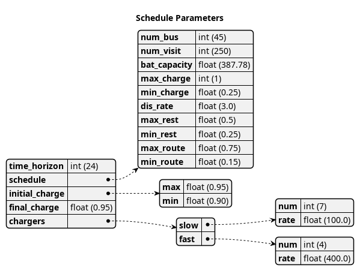

\begin{table}
	\caption{Notation used throughout the paper}
	\label{tab:variables}
	\centering
	\begin{tabular}{l l l l}
		\toprule
		\textbf{Variable} & \textbf{Description}                                                                 \\
		\toprule
		\multicolumn{1}{l}{Input values}                                                                         \\
			$B$        & Number of buses in use                                                              \\
			$I$        & Number of total visits                                                              \\
			$J(u,e,v)$ & Objective function                                                                  \\
			$K$        & Local search iteration amount                                                       \\
			$Q$        & Number of chargers                                                                  \\
			$T$        & Time horizon                                                                        \\
			$\Tau$     & Temperature                                                                         \\
		\hline
		\multicolumn{1}{l}{Input variables}                                                                      \\
			$\Delta_i$                  & Discharge of visit over route $i$                                  \\
			$\Xi_i$                     & Array of ID's for each visit $i$                                   \\
			$\alpha_i$                  & Initial charge percentage time for visit $i$                       \\
			$\beta_i$                   & Final charge percentage for bus $i$ at the end of the time horizon \\
			$\delta_i$                  & Discharge rate for vehicle $i$                                     \\
			$\epsilon_q(v_i, u_i, d_i)$ & Returns cost of using charger $q$ per unit time                    \\
			$\pi_k$                     & Local search iteration $k$                                         \\
			$\xi_i$                     & Array of values indicating the next index visit $i$ will arrive    \\
			$a_i$                       & Arrival time of visit $i$                                          \\
			$b_i$                       & ID for bus visit $i$                                               \\
			$e_i$                       & Time visit $i$ must exit the station                               \\
			$k_i$                       & Battery capacity for bus $i$                                       \\
			$m_i$                       & Minimum charge allowed on departure of visit $i$                   \\
			$r_q(v_i, u_i, d_i)$        & Returns charge rate of charger $q$ per unit time [$KW$]            \\
		\hline
		\multicolumn{1}{l}{Decision Variables}                                                                   \\
			$\eta_i$     & Initial charge for visit $i$                                                      \\
			$d_i$        & Detach time from charger for visit $i$                                            \\
			$s_i$        & Amount of time spent on charger for visit $i$ (service time)                      \\
			$u_i$        & Initial charge time of visit $i$                                                  \\
			$v_i$        & Assigned queue for visit $i$                                                      \\
			$p_{dem}(t)$ & Demand cost                                                                       \\
			\bottomrule
	\end{tabular}
\end{table}

This document outlines the simulated annealing approach to the bus charging scheduling problem utilizing Mixed Integer Linear Programming (MILP) constraints as the method of determining feasible charging schedules. The problem statement is as follows: given a set of routes for a feet of Battery Electric Buses (BEB), generate an optimal charging schedule to minimize

* Consumption cost (amount of electricity used over a certain time)
* Demand cost (rate at which electricity is being used)

within the constraints that the buses have sufficient charge to complete the working day and do not have any delays in departing from the station.

Simulated Annealing (SA) shall be introduced and utilized as a means of finding the global optima of the objective function/MILP constraint formulation; however, there are other mechanisms similar to SA that may be utilized.

# Simulated Annealing
SA is a local search (exploitation oriented) single-solution based (as compared to population based) metaheuristic approach in which its main advantage is simplicy [@Gendreau2018-pw]. This model is named after its analogised process where a crystalline solid is headed then allowed to cool very slowly until it achieves its most regular possible crystal lattice configuration [@Henderson]. There are five key components to SA:

* Initial Temperature
* Cooling schedule (temperature function)
* Generation mechanism
* Acceptance criteria
* Local search iteration count (temperature change counter)

The initial temperature and cooling schedule are used to regulate the speed at which the solution attempts to converge to the best known solution. When the temperature is high SA encourages exploration, as it cools down (in accordance to the cooling schedule) it begins to encourage local exploitation of the solution [@Rutenbar_1989; @Henderson].

## Cooling Equation (Experimental)
There are three basic types of cooling equations as shown in Fig \ref{fig:cool}: 

* Linear: $T[n] = \Tau[n-1] -\beta_n$
* Geometric: $T[n] = \alpha T[n-1]$ (most used in practice according to [@Keller_2019])
* Exponential: $T[n] = e^{\beta}T[n-1]$

The initial temperature in the case of Fig \ref{fig:cool} the initial temperature $\Tau_0$ is set to $500^\circ\; C$.

## Generation Mechanism
Generation mechanism in SA are used to generate random solutions to propose to the system. For the case of the bus generation, three generation mechanism shall be used. One of them being to generate a set of bus routes data and the other two used to generate candidate solutions to the bus routes. These routes are defined as follows:

* Route generation (Fig \ref{fig:route}) which utilizes the data from Fig \ref{fig:routeyaml}
* Schedule generation (Fig \ref{fig:schedule})
* Tweak schedule (Fig \ref{fig:tweak})

### Route Generation
The objective of route generate a set of metadata about bus routes given the information in Fig \ref{fig:routeyaml}. Specifically, the objective is to generate $I$ amount of routes for $B$ amount of buses. Each visit will have

* Initial charge (for first visit only)
* Arrival time
* Departure time

This is created by following the "GenerateSchedule" state in the state diagram found ind Figure \ref{fig:route}. In essence the logic is as follows: Generate $B$ random numbers that add up to $I$ visits (with a minimum amount of visits set for each bus). For each bus and for each visit, set a departure time that is greater than the arrival time, set the next arrival time to be $i \cdot \frac{T}{\text{number of bus visits}}$ where $i$ is the $i^{th}$ visit. Finally calculate the amount of discharge from previous arrival to the departure time.

### Schedule Generation
The objective of this generator is to generate a candidate solution to the given schedule. To generate a candidate solution the generator is given the route schedule data that was previous generated. A bus is picked at random, $b \in B$, then a random route is picked for bus $b$. Given the bus and route data, a list of valid regions (which is a time zone/charger tuple) are found and randomly picked from. The process is depicted in the state digram in Fig \ref{fig:schedule}.

### Tweak Schedule
As described in SA, local searches are also employed to try and exploit given solutions. This exploitation method is as follows: pick a bus, calculate both the "slide" amount and find any other valid open regions available. This "slide" is the amount the bus is allows to move forward or backward in time on the same queue without breaking any of the constraints (discussed later). Randomly pick slide or region. This procedure is depicted in Fig \ref{fig:tweak}.

# Optimization Problem

## Objective Function
The objective function(s) should take into consideration

* Time on the charger (consumption charge)
* Which charger (slow/fast/index)
* Power usage (Peak times/P15/time)
* Time (Peak times/P15)
<!-- * Temperature (Encourage exploration at the beginning and discourage near the end) TODO: Find reference on this -->

Let $J$ represent the objective function. The objective function has three main considerations

* Charger assignment
* Demand cost
* Consumption cost
<!-- * Temperature TODO: Find reference -->

which would be of the form $J = AC(u, d, v) + PC(u, d, v)$. $AC(u, d, v)$ is the assignment cost, and $PC(u, d, v)$ is the power usage cost. The assignment cost can be broken down into two components:

$$
AC(u,d,v) = \sum_{i=1}^I \sum_{q=1}^Q  \epsilon_q(v_i, u_i, d_i)
$$

Where $w_{iq}$ is the assignment of visit $i$ to charger $q$, $c_i$ is the charge duration for visit $i$, and $\epsilon_q$ is the cost of usage for charger $q$. The consumption cost is represented as

$$
PC(u,d,v) = \sum_{i=1}^I \sum_{q=1}^Q r_q(v_i, u_i, d_i)
$$

where $r_q(v_i, u_i, d_i)$ returns the energy in $KWH$ given the charger index $v_i$ and time spent on the charger $s_i$. Peak 15 should also be taken into consideration. P15 can be written as:

$$
p_{15}(t) = 1/15 \int_{t-15}^{t} p(\tau) d\tau
$$

because worst case must be assumed to always ensure enough power is supplied

$$
p_{max}(t) = \text{max}_{\tau\in [0,t]}p_{15}(\tau)
$$

The demand charge is then determined by

$$
p_{dem}(t) = \text{max}(p_{fix},p_{max}(t))s_r
$$

where $s_r$ is the demand rate. From this we can write:

$$
PC(u,d,v) = p_{dem}(T) + \sum_{i=1}^I \sum_{q=1}^Q r_q(v_i, u_i, d_i)
$$

## Constraints
Now that a method of calculating the fitness of a schedule has been established, a method for determining if the schedule is feasible must be determined. Feasible schedule require

* No overlap in time
* No overlap in space
* Bus receives enough charge
* Leaves on time

$$
\begin{array}{ll}
	(e_i \geq u_j \text{ or } D_j \geq u_i) \text{ and } v_i = v_j     & \text{Valid time}                                                        \\
	a_i \leq u_i \leq (T-s_i)                                          & \text{Arrival time < initial charge time < maximum initial charge time}  \\
	d_i \leq e_i                                                       & \text{Detatch time should be less than or equal to departure time}       \\
	\eta_{\xi_i} = \eta_i + \sum_{q=1}^Q r_q(v_i, a_i, e_i) + \Delta_i & \text{Charge constraint (initial and final charges can also be applied)} \\
	\eta_{\xi_i} \geq \lambda_i                                        & \text{Sufficient charge is supplied to the bus}                          \\
\end{array}
$$

# References

