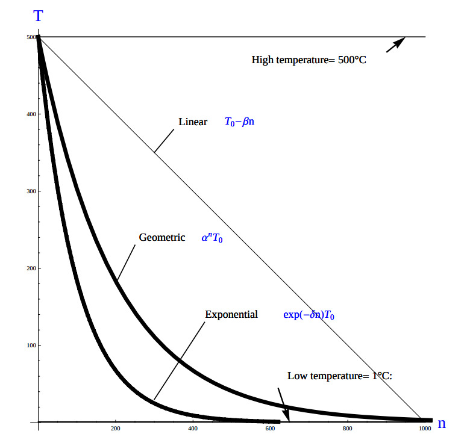
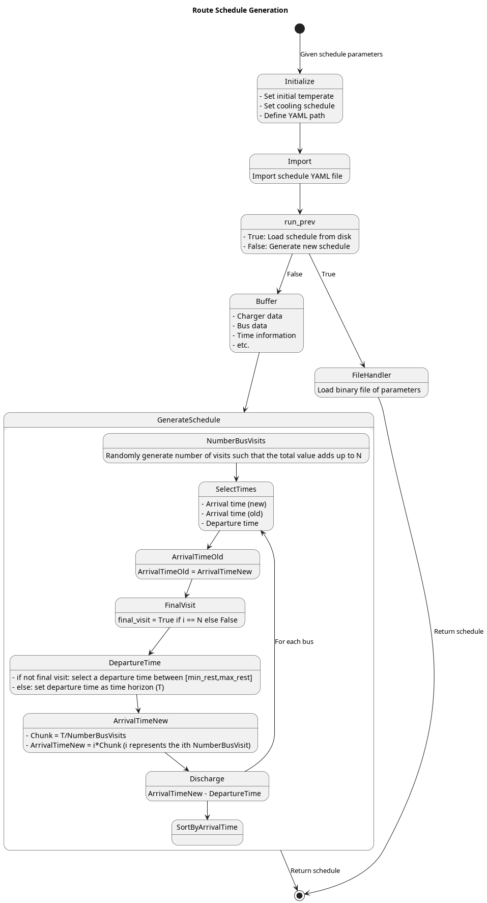
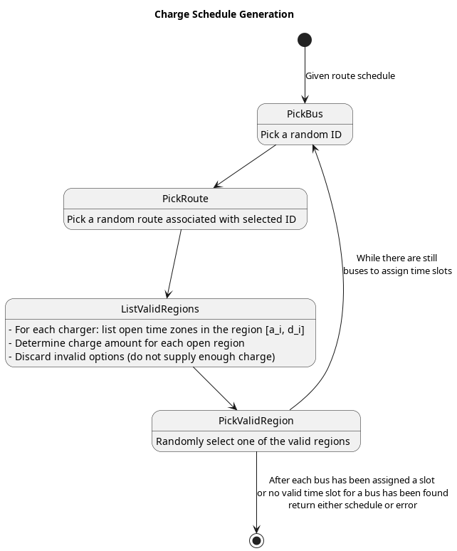
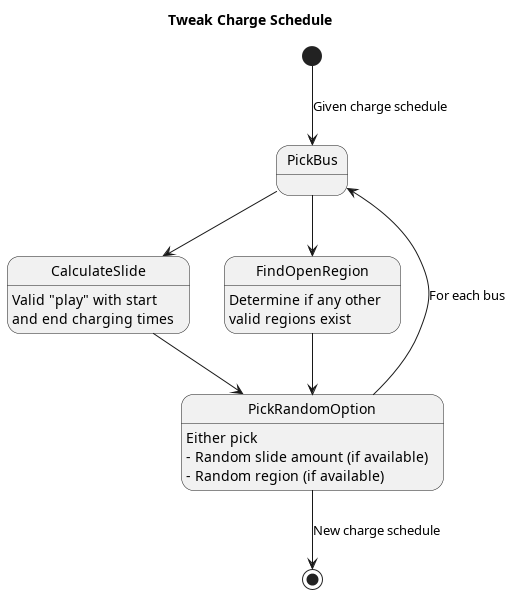

***

This document outlines the simulated annealing approach to the bus charging scheduling problem utilizing Mixed Integer Linear Programming (MILP) constraints as the method of determining feasible charging schedules. The problem statement is as follows: given a set of routes for a fleet of Battery Electric Buses (BEB), generate an optimal charging schedule to minimize:

* Consumption cost (amount of electricity used over a certain time)
* Demand cost (rate at which electricity is being used)

within the constraints that the buses have sufficient charge to complete the working day and do not have any delays in departing from the station.

Simulated Annealing (SA) shall be introduced and utilized as a means of finding the global optima of the objective function/MILP constraint formulation; however, there are other mechanisms similar to SA that may be utilized.

# Simulated Annealing
SA is a local search (exploitation oriented) single-solution based (as compared to population based) metaheuristic approach in which its main advantage is simplicy [@Gendreau2018-pw]. This model is named after its analogised process where a crystalline solid is heated then allowed to cool very slowly until it achieves its most regular possible crystal lattice configuration [@Henderson]. There are five key components to SA:

* Initial Temperature
* Cooling schedule (temperature function)
* Generation mechanism
* Acceptance criteria
* Local search iteration count (temperature change counter)

The initial temperature and cooling schedule are used to regulate the speed at which the solution attempts to converge to the best known solution. When the temperature is high SA encourages exploration. As it cools down (in accordance to the cooling schedule), it begins to encourage local exploitation of the solution [@Rutenbar_1989; @Henderson].

## Cooling Equation (Experimental)
There are three basic types of cooling equations as shown in \autoref{fig:cool}. A linear cooling schedule is defined by

$$
T[n] = \Tau[n-1] -\Delta_0
$$

with $T[0] = T_0$ and $Delta_0 = 1/2\; C^\circ$. A geometric cooling schedule is mostly used in practice [@Keller_2019]. It is defined by

$$
T[n] = \alpha T[n-1]
$$

where $\alpha = 0.995$. An Exponential cooling schedule is defined by the difference equation is define as

$$
T[n] = e^{\beta}T[n-1]
$$

where $\beta$ = 0.01$. The initial temperature in the case of \autoref{fig:cool} the initial temperature $\Tau_0$ is set to $500^\circ\; C$ and each schedule's final temperature is $1\; C^\circ$.



## Generation Mechanisms
Generation mechanisms in SA are used to generate random solutions to propose. For the case of the bus generation, five generation mechanism shall be used:

* New visit
* Slide visit
* New charger
* New window
* Remove

These generator mechanisms will in turn be utilized by three wrapper functions. One of them being to generate a set of bus route data and the other two used to generate candidate solutions to the bus routes. These routines are defined as follows:

* Route generation, \autoref{fig:route}, which utilizes the data from \autoref{fig:routeyaml}
* Schedule generation, \autoref{fig:schedule}
* Tweak schedule, \autoref{fig:tweak}

### Generators
This section describes and outlines the algorithm pool for the different generator types that are utilized in the wrapper functions.  Note that to satisfy constraints, $B$ extra dummy chargers with a power of $0 W$ will be added to the array of valid chargers. When a bus is not to be placed on a charger, it will be placed in the queue $v_i \in [Q,...,Q+b]$. Where $Q$ is the total amount of chargers and $b$ is the bus id value. Furthremore $B$ more queues will be created while buses are on route. The discharge rate for each bus will be placed in each $v_i \in [Q+b,..,Q+2b]$ queue.

#### New visit
The new visit generator describes the process of moving bus $b$ from the idle queue, $[Q,..,Q+b]$, or discharge queue, $[Q+b,..Q+2b]$, to a valid charging queue, $v_i \in [0,..,Q]$. A list of valid values for $u_i$ and $d_i$ for each charger will be listed and randomly selected using a uniform distribution.

```C
```

#### Slide visit
Slide visit is used for buses that have already been scheduled. Because $a_i \leq u_i \leq d_i \leq e_i$ (arrival time is less than initial charge time which is less than the detatch time which is less than the time the bus exists the station), there may be some room to move $u_i$ and $d_i$ within the window  $[a_i, e_i]$. Two new values, $u_i$ and $d_i$ are generated to satisfy $a_i leq u_i \leq d_i \leq e_i$.

```C
```

#### New charger

```C
```

#### New window

```C
```

#### Remove

```C
```

### Gerator Wrappers
This section covers the algorithms utilized to select and execute different generation processes for the SA process.

#### Route Generation
The objective of route generate a set of metadata about bus routes given the information in \autoref{fig:routeyaml}. Specifically, the objective is to generate $I$ routes for $B$ buses. Each visit will have

* Initial charge (for first visit only)
* Arrival time
* Departure time
* Final charge (for finial visit only)

This is created by following the "GenerateSchedule" state in the state diagram found ind \autoref{fig:route}. In essence the logic is as follows: Generate $B$ random numbers that add up to $I$ visits (with a minimum amount of visits set for each bus). For each bus and for each visit, set a departure time that is between the range [min_rest, max_rest] (\autoref{fig:routeyaml}), set the next arrival time to be $j \cdot \frac{T}{\text{number of bus visits}}$ where $j$ is the $j^{th}$ visit for bus $b$. Finally, calculate the amount of discharge from previous arrival to the departure time.

```C
```

#### Schedule Generation
The objective of this generator is to generate a candidate solution to the given schedule. To generate a candidate solution the generator is given the route schedule data that was previous generated. A bus is picked at random, $b \in B$, then a random route is picked for bus $b$. Given the bus and route data, a list of valid regions (which is a time zone/charger tuple) are found and randomly picked from. The process is depicted in the state digram in \autoref{fig:schedule}.

```C
```

#### Tweak Schedule
As described in SA, local searches are also employed to try and exploit a given solution. The method that will be employed to exploit the given solution is as follows: pick a bus, calculate both the "slide" amount and find any other valid open regions available. This "slide" is the amount the bus is allows to move forward or backward in time on the same queue without breaking any of the constraints (discussed later). Randomly pick slide or region. This procedure is depicted in \autoref{fig:tweak}.

```C
```

# Optimization Problem
\begin{table}
	\caption{Notation used throughout the paper}
	\label{tab:variables}
	\centering
	\begin{tabular}{l l l l}
		\toprule
		\textbf{Variable} & \textbf{Description}                                                                 \\
		\toprule
		\multicolumn{1}{l}{Input values}                                                                         \\
			$B$        & Number of buses in use                                                              \\
			$I$        & Number of total visits                                                              \\
			$J(u,e,v)$ & Objective function                                                                  \\
			$K$        & Local search iteration amount                                                       \\
			$Q$        & Number of chargers                                                                  \\
			$T$        & Time horizon (T)                                                                    \\
			$\Tau$     & Temperature  (Tau)                                                                  \\
		\hline
		\multicolumn{1}{l}{Input variables}                                                                      \\
			$\Delta_i$                  & Discharge of visit over route $i$                                  \\
			$\Xi_i$                     & Array of ID's for each visit $i$                                   \\
			$\alpha_i$                  & Initial charge percentage time for visit $i$                       \\
			$\beta_i$                   & Final charge percentage for bus $i$ at the end of the time horizon \\
			$\delta_i$                  & Discharge rate for vehicle $i$                                     \\
			$\epsilon_q(v_i, u_i, d_i)$ & Returns cost of using charger $q$ per unit time                    \\
			$\pi_k$                     & Local search iteration $k$                                         \\
			$\xi_i$                     & Array of values indicating the next index visit $i$ will arrive    \\
			$a_i$                       & Arrival time of visit $i$                                          \\
			$b_i$                       & ID for bus visit $i$                                               \\
			$e_i$                       & Time visit $i$ must exit the station                               \\
			$k_i$                       & Battery capacity for bus $i$                                       \\
			$m_i$                       & Minimum charge allowed on departure of visit $i$                   \\
			$r_q(v_i, u_i, d_i)$        & Returns charge rate of charger $q$ per unit time [$KW$]            \\
		\hline
		\multicolumn{1}{l}{Decision Variables}                                                                   \\
			$\eta_i$     & Initial charge for visit $i$                                                      \\
			$d_i$        & Detach time from charger for visit $i$                                            \\
			$s_i$        & Amount of time spent on charger for visit $i$ (service time)                      \\
			$u_i$        & Initial charge time of visit $i$                                                  \\
			$v_i$        & Assigned queue for visit $i$                                                      \\
			$p_{dem}(t)$ & Demand cost                                                                       \\
			\bottomrule
	\end{tabular}
\end{table}


## Objective Function
Let $J$ represent the objective function. The objective function has three main considerations:

* Charger assignment
* Demand cost
* Consumption cost
<!-- * Temperature TODO: Find reference -->

which would be of the form $J = AC(u, d, v) + PC(u, d, v)$. $AC(u, d, v)$ is the assignment cost, and $PC(u, d, v)$ is the power usage cost. The assignment cost can be represented as:

$$
AC(u,d,v) = \sum_{i=1}^I \sum_{q=1}^Q  \epsilon_q(v_i, u_i, d_i)
$$

Where $v_i$ is the charger index, $u_i$ is the initial charge time, and $d_i$ is the detach time for visit $i$. The function $\epsilon(v,u,d)$ returns the cost of using charger $q$ multiplied by the usage time 

$$
\epsilon_q[v_i](d_i - u_i)
$$

The power cost can begin to be defined with the consumption cost:

$$
PC(u,d,v) = \sum_{i=1}^I \sum_{q=1}^Q r_q(v_i, u_i, d_i)
$$

where $r_q(v_i, u_i, d_i)$ returns the energy in $KWH$ given the charger index $v_i$ and time spent on the charger $d_i$ 

$$
r_q[v_i](d_i - u_i)
$$

Peak 15 should also be taken into consideration. P15 is defined as:

$$
p_{15}(t) = 1/15 \int_{t-15}^{t} p(\tau) d\tau
$$

which represents the energy used over the last 15 minutes. Because worst case must be assumed to always ensure enough power is supplied

$$
p_{max}(t) = \text{max}_{\tau\in [0,t]}p_{15}(\tau)
$$

Which retains the largest $p_{15}$ found. The demand charge is then determined by

$$
p_{dem}(t) = \text{max}(p_{fix},p_{max}(t))s_r
$$

where $s_r$ is the demand rate. Which, again, retains the largest $p_{15}$ value with a starting, fixed value of $p_{fix}$. From this we can write:

$$
PC(u,d,v) = p_{dem}(T) + \sum_{i=1}^I \sum_{q=1}^Q r_q(v_i, u_i, d_i)
$$


## Constraints
Now that a method of calculating the fitness of a schedule has been established, a method for determining if the schedule is feasible must be determined. Feasible schedule require

* No overlap in time
* No overlap in space
* Bus receives enough charge
* Departs on time

These set of requirements can be summarized by the constraints that follow:

$$
\begin{array}{ll}
	(u_i \geq d_j \text{ or } u_j \geq d_i) \text{ and } v_i = v_j        & \text{Valid queue position/time}                                                        \\
	a_i \leq u_i \leq (T-s_i)                                             & \text{Arrival time < initial charge time < maximum initial charge time}                 \\
	d_i \leq e_i                                                          & \text{Detatch time should be less than or equal to departure time}                      \\
	\eta_{\xi_i} = \eta_i + \sum_{q=1}^Q r_q(v_i, a_i, e_i) + \Delta_i    & \text{Charge constraint}                                                                \\
	\eta_{\xi_i} \geq \eta_i + \sum_{q=1}^Q r_q(v_i, a_i, e_i) + \Delta_i & \text{Sufficient charge is supplied to the bus}                                         \\
	\eta_{\xi_i} \geq m_i                                                 & \text{Sufficient charge is supplied to exceed threshold (initial and final charge)}     \\
	s_i = d_i - u_i 											          & \text{Time spent on charger is equal to the difference of the attach and detatch times} \\ 
\end{array}
$$

Where the valid queue position/time constraint is as defined in [@tutorials_point]. Also note that the last two constraints can only be verified *after* the schedule has been generated as the initial charge for each visit is based from the previous charger selection and charge time.

\begin{figure}
\centering
\begin{subfigure}{\textwidth}
    \centering
    \caption{Valid time position: $u_1 \ngeq d_2$ or $u_2 \geq d_2$}
    \begin{tikzpicture}
        \coordinate (A) at (0,0);
        \coordinate (B) at (2,0);
        \coordinate (C) at (2.5,0);
        \coordinate (D) at (4.5,0);

        \draw[blue] (A) -- (B);
        \draw[red] (C) -- (D);

        \node[circle,fill=blue,radius=0.15,label=above : $u_1$] at (A) {};
        \node[circle,fill=blue,radius=0.15,label=above : $d_1$] at (B) {};
        \node[circle,fill=red,radius=0.15,label=above  : $u_2$] at (C) {};
        \node[circle,fill=red,radius=0.15,label=above  : $d_2$] at (D) {};
    \end{tikzpicture}
\end{subfigure}

\begin{subfigure}{\textwidth}
    \centering
    \caption{Invalid position: $u_1 \ngeq d_2$ or $u_2 \ngeq d_1$}
    \begin{tikzpicture}
        \coordinate (A) at (0,0);
        \coordinate (B) at (3.5,0);
        \coordinate (C) at (1.5,0);
        \coordinate (D) at (4.5,0);

        \draw[blue] (A) -- (B);
        \draw[red] (C) -- (D);

        \node[circle,fill=blue,radius=0.15,label=above : $u_1$] at (A) {};
        \node[circle,fill=blue,radius=0.15,label=above : $d_1$] at (B) {};
        \node[circle,fill=red,radius=0.15,label=above  : $u_2$] at (C) {};
        \node[circle,fill=red,radius=0.15,label=above  : $d_2$] at (D) {};
    \end{tikzpicture}
\end{subfigure}

\begin{subfigure}{\textwidth}
    \centering
    \caption{Invalid position: $u_1 \ngeq d_2$ or $u_2 \ngeq d_1$}
    \begin{tikzpicture}
        \coordinate (A) at (0,0);
        \coordinate (B) at (4.5,0);
        \coordinate (C) at (1.0,0);
        \coordinate (D) at (3.0,0);

        \draw[blue] (A) -- (B);
        \draw[red] (C) -- (D);

        \node[circle,fill=blue,radius=0.15,label=above : $u_1$] at (A) {};
        \node[circle,fill=blue,radius=0.15,label=above : $d_1$] at (B) {};
        \node[circle,fill=red,radius=0.15,label=above  : $u_2$] at (C) {};
        \node[circle,fill=red,radius=0.15,label=above  : $d_2$] at (D) {};
    \end{tikzpicture}
\end{subfigure}
\end{figure}

# References







